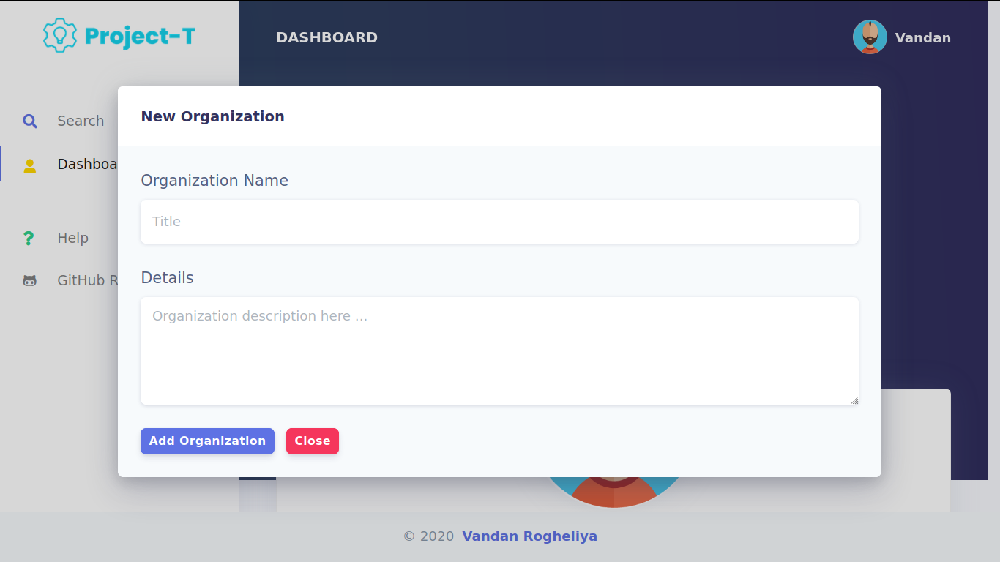
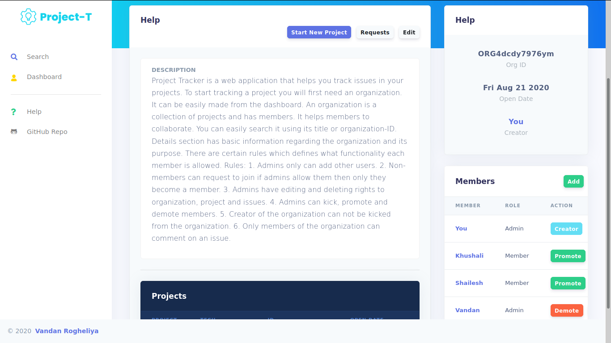
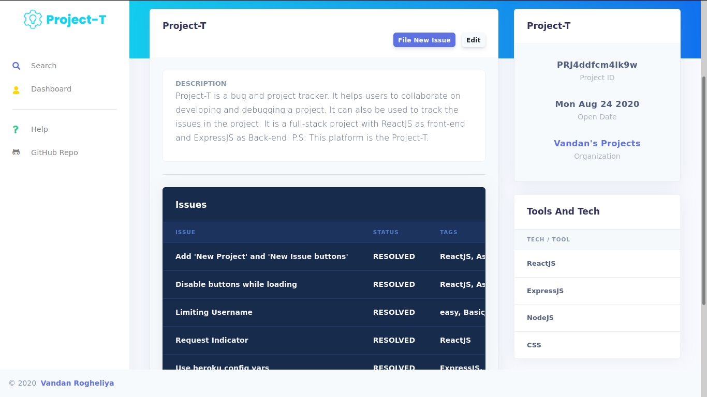
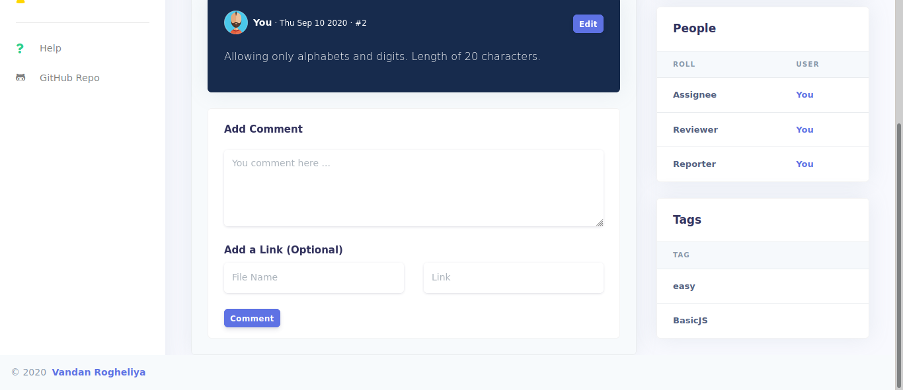

<!-- PROJECT LOGO -->
 

  

  <h3 align="center">Project Tracker</h3>

  

    A bug tracker
     
     
    <a href="https://projectbugtracker.vercel.app">Visit site</a>
    ·
    <a href="https://github.com/VandanRogheliya/Project-Tracker-Client-ReactJS">Client Repo</a>
    ·
    <a href="https://github.com/VandanRogheliya/Project-Tracker-API-ExpressJS">API Repo</a>
  

<!-- TABLE OF CONTENTS -->

  
<h2 style="display: inline-block">Table of Contents</h2>

  <ol>
    <li>
      <a href="#about-the-project">About The Project</a>
      <ul>
        <li><a href="#features">Features</a></li>
        <li><a href="#roles-in-detail">Roles in Detail</a></li>
        <li><a href="#built-with">Built With</a></li>
      </ul>
    </li>
    <li>
    <a href="#usage">Usage</a>
      <ul>
        <li><a href="#organizations">Organizations</a></li>
        <li><a href="#projects">Projects</a></li>
        <li><a href="#issues">Issues</a></li>
      </ul>
    </li>
    <li><a href="#contact">Contact</a></li>
    <li><a href="#repositories">Repositories</a></li>
  </ol>

<!-- ABOUT THE PROJECT -->

## About The Project

  

Project Tracker is a web application that helps to track bugs in projects. Users around the globe can collaborate on multiple projects and make them better.

### Features

- **OAuth2 Authentication**: Users can use their GitHub or Google account to authenticate.

- **Opening new issues**: Add description, deadline, tags, links, status, assignee and reviewer.

- **Managing Projects**: Make your organization to group all your projects.

- **Roles**: Each org will have creator, admins and members. [Click here to know more](#roles-in-detail).

- **Add Projects**: Add projects to an organization, mention tools and technologies required to build it.

- **Commenting on issues**

- **Dashboard**: Access all bugs you have interacted which are categorized accordingly. Also, access all the organizations you are part of.

- **Account Management**: Change username, first name, last name, email and profile picture.

- **Searching**: Issues, Projects, Organizations and Users

- **Works on all screens sizes**

- **Editing And Deleting**: Issues, Projects, Organizations and Comments can be edited or deleted after uploading

### Roles in Detail

The level of access each user has in an organization depends on his/her role. He/she can either be a member, admin or creator.

Levels of access in decreasing order are:

1. Creator
2. Admin
3. Member
4. Non-member

- **Non-member**: can view all the content of the org but can not interact. He/She can be added to org or can send a request.

- **Member**: can send issues for approval and comment on issues

- **Admin**: can add issues, approve issues, open new projects, promote members to admin, demote other admins to members, kick members and admins, add non-members to the organization, approve or deny requests to join the organization, edit and delete issues and projects and edit organization description.

- **Creator**: can not be kicked by any other user and can delete the organization.

Access levels of all lower roles are included in the higher one. For example, admin can do whatever a member can do.

### Built With

- [ExpressJS](https://expressjs.com/)
- [NodeJS](https://nodejs.org/en/)
- [PassportJS](http://www.passportjs.org/)
- [MongoDB](https://www.mongodb.com/)
- [ReactJS](https://reactjs.org/)
- [React Router](https://reactrouter.com/)
- [Bootstrap](https://getbootstrap.com/)

<!-- USAGE EXAMPLES -->

## Usage

### Organizations

To start tracking any project you will first require to open an organization. It is used to group projects and define which users have what access level in the org. More on roles and access level [here](#roles-in-detail).

- Create organization from 'Dashboard'
  

    
  

- Add new projects, view all projects, check requests to join, edit organization and manage members
  

    
  

### Projects
Projects group all the issues related to a particular project. It also carries what tools and technology are being used in it.

- Create projects from 'Dashboard' or from Organization home page
- Add new issues, edit project, view tools and tech and all issues
  

    
  

### Issues
1. Issues contain basic information about an issue, like status, deadline, type (bug or enhancement), how to recreate a bug, roles etc.

2. When an issue is filed it will be in UNAPPROVED status. Then admins can review the issue and make it OPEN. If the issue is not valid admin will change the status to CLOSE.

3. Members of the organization can comment on the issue and admins will assign the issue to one of those members. There will also be a reviewer who will be responsible for reviewing the solution and guiding the assignee.

4. More than one user can also participate but only one of them will be called the assignee.

5. When the reviewer is satisfied with the solution offered by the assignee he will change the status to RESOLVED.

6. The issue can be REOPENed if admins feel the solution accepted was not sufficient.

7. One Attachment can be added to issue.

8. Tags can be added for easy searching.

    
    
  

<!-- CONTACT -->

## Contact

LinkedIn - [Vandan Rogheliya](https://www.linkedin.com/in/vandanrogheliya/) - rogheliavandan@outlook.com

<!-- REPOSITORIES -->

## Repositories

[Client Repository](https://github.com/VandanRogheliya/Project-Tracker-Client-ReactJS)

[API Repository](https://github.com/VandanRogheliya/Project-Tracker-API-ExpressJS)
