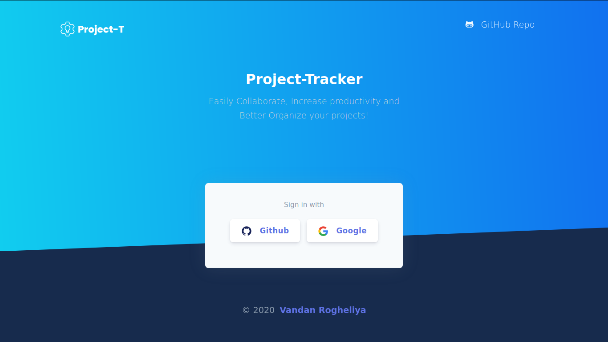

<!-- PROJECT LOGO -->
<br />
<p align="center">
  <a href="https://vproject-t.herokuapp.com">
    
  </a>

  <h3 align="center">Project Tracker</h3>

  <p align="center">
    A bug tracker
    <br />
    <br />
    <a href="https://vproject-t.herokuapp.com">Visit site</a>
    ·
    <a href="https://github.com/VandanRogheliya/Project-Tracker-Client-ReactJS/issues">Report Bug</a>
    ·
    <a href="https://github.com/VandanRogheliya/Project-Tracker-Client-ReactJS/issues">Request Feature</a>
  </p>
</p>


<!-- TABLE OF CONTENTS -->
<details open="open">
  <summary><h2 style="display: inline-block">Table of Contents</h2></summary>
  <ol>
    <li>
      <a href="#about-the-project">About The Project</a>
      <ul>
        <li><a href="#built-with">Built With</a></li>
      </ul>
    </li>
    <li>
      <a href="#getting-started">Getting Started</a>
      <ul>
        <li><a href="#prerequisites">Prerequisites</a></li>
        <li><a href="#installation">Installation</a></li>
      </ul>
    </li>
    <li><a href="#usage">Usage</a></li>
    <li><a href="#roadmap">Roadmap</a></li>
    <li><a href="#contributing">Contributing</a></li>
    <li><a href="#license">License</a></li>
    <li><a href="#contact">Contact</a></li>
    <li><a href="#acknowledgements">Acknowledgements</a></li>
  </ol>
</details>


<!-- ABOUT THE PROJECT -->
## About The Project

<p align="center">
  
</p>

Project Tracker is a web application that helps to track bugs in projects. Users around the globe can collaborate on multiple projects and make them better.

### Features

 * **OAuth2 Authentication**: Users can use their GitHub or Google account to authenticate

 * **Opening new issues**: Add description, deadline, tags, links, status, assignee and reviewer.
 
 * **Managing Projects**: Make your organization to group all your projects.

 * **Roles**: Each org will have creator, admins and members. [Click here to know what each role can do]().
 
 * **Add Projects**:  Organization is required to add a project.
 
 * **Commenting on issues**
 
 * **Managing Roles**: Admins and higher can demote, promote and kick other lower roles. Admins and higher can invite other users to the organization or other users can request to join.
 
 * **Dashboard**: Access all bugs you have interacted which are categorized accordingly. Also, access all the organizations you are part of.

 * **Account Management**: Change username, first name, last name, email and profile picture.

 * **Searching**: Issues, Projects, Organizations and Users 
 
 * **Works on all screens sizes**

 * **Editing And Deleting**: Issues, Projects, Organizations and Comments can be edited or deleted after uploading

### How to use it


### Built With

* []()
* []()
* []()


<!-- GETTING STARTED -->
## Getting Started

To get a local copy up and running follow these simple steps.

### Prerequisites

This is an example of how to list things you need to use the software and how to install them.
* npm
  ```sh
  npm install npm@latest -g
  ```

### Installation

1. Clone the repo
   ```sh
   git clone https://github.com/VandanRogheliya/Project-Tracker-Client-ReactJS.git
   ```
2. Install NPM packages
   ```sh
   npm install
   ```


<!-- USAGE EXAMPLES -->
## Usage

Use this space to show useful examples of how a project can be used. Additional screenshots, code examples and demos work well in this space. You may also link to more resources.

_For more examples, please refer to the [Documentation](https://example.com)_


<!-- ROADMAP -->
## Roadmap

See the [open issues](https://github.com/VandanRogheliya/Project-Tracker-Client-ReactJS/issues) for a list of proposed features (and known issues).


<!-- CONTRIBUTING -->
## Contributing

Contributions are what make the open source community such an amazing place to be learn, inspire, and create. Any contributions you make are **greatly appreciated**.

1. Fork the Project
2. Create your Feature Branch (`git checkout -b feature/AmazingFeature`)
3. Commit your Changes (`git commit -m 'Add some AmazingFeature'`)
4. Push to the Branch (`git push origin feature/AmazingFeature`)
5. Open a Pull Request


<!-- CONTACT -->
## Contact

LinkedIn - [Vandan Rogheliya](https://www.linkedin.com/in/vandanrogheliya/) - rogheliavandan@outlook.com

Project Link: [https://github.com/VandanRogheliya/Project-Tracker-Client-ReactJS](https://github.com/VandanRogheliya/Project-Tracker-Client-ReactJS)


<!-- ACKNOWLEDGEMENTS -->
## Acknowledgements

* []()
* []()
* []()


<!-- MARKDOWN LINKS & IMAGES -->
<!-- https://www.markdownguide.org/basic-syntax/#reference-style-links -->
[contributors-shield]: https://img.shields.io/github/contributors/VandanRogheliya/repo.svg?style=for-the-badge
[contributors-url]: https://github.com/VandanRogheliya/repo/graphs/contributors
[forks-shield]: https://img.shields.io/github/forks/VandanRogheliya/repo.svg?style=for-the-badge
[forks-url]: https://github.com/VandanRogheliya/repo/network/members
[stars-shield]: https://img.shields.io/github/stars/VandanRogheliya/repo.svg?style=for-the-badge
[stars-url]: https://github.com/VandanRogheliya/repo/stargazers
[issues-shield]: https://img.shields.io/github/issues/VandanRogheliya/repo.svg?style=for-the-badge
[issues-url]: https://github.com/VandanRogheliya/repo/issues
[license-shield]: https://img.shields.io/github/license/VandanRogheliya/repo.svg?style=for-the-badge
[license-url]: https://github.com/VandanRogheliya/repo/blob/master/LICENSE.txt
[linkedin-shield]: https://img.shields.io/badge/-LinkedIn-black.svg?style=for-the-badge&logo=linkedin&colorB=555
[linkedin-url]: https://linkedin.com/in/VandanRogheliya
